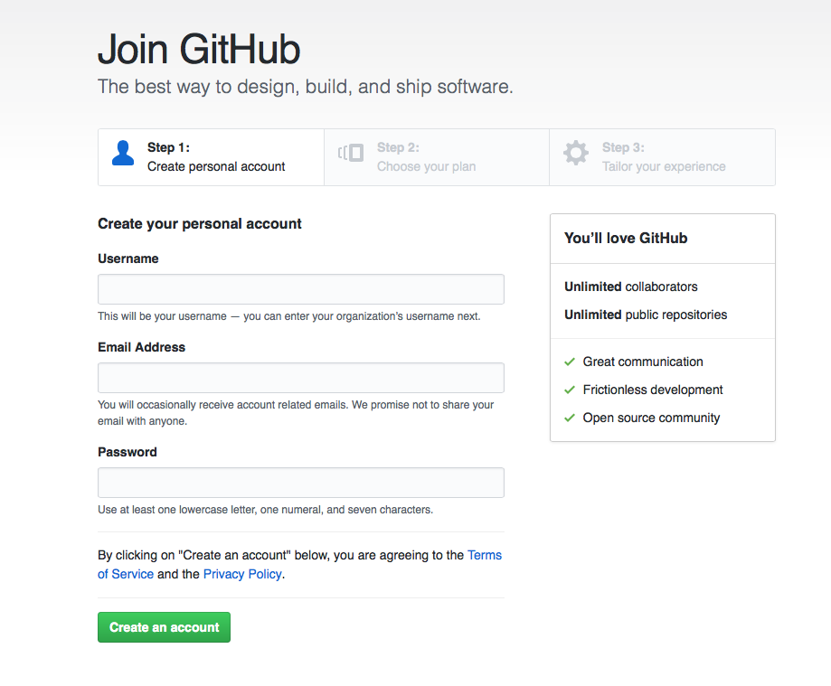
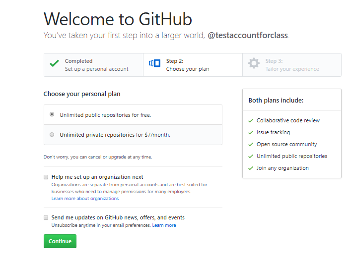
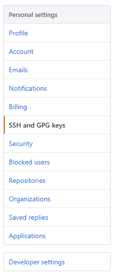
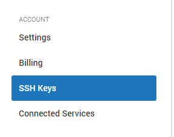
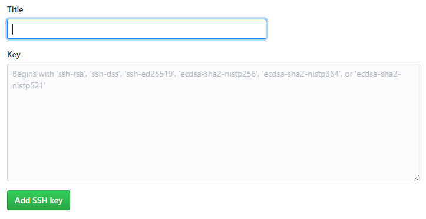

# GitHub Tutorial

_by David Gonzalez_

---
## Git vs. GitHub
<p align="center">
  
</p>

<p align="center">
  
</p>  

_**Pictures are property of Git and Github**_  

[**Git**](https://git-scm.com/) was initially released on _April 7, 2005_ by its creator _Linus Torvalds_. It is a service that manages multiple versions of `code`. Any directory with git in it is a repository. Any git repository can be uploaded to github. [**Github**](https://github.com) was initially released on _April 10, 2008_ by its creator _Tom Preston-Werner_. It is a cloud drive where you can repositories live. Git does **not** need Github to work.


---
## Initial Setup

### Creating A Github Account:
1. Go on [**github.com**](https://github.com).
2. Click **Sign Up** in the top right corner of the window. **v**

<p align="center">
  
</p>

3. Follow all the steps for step 1.

<p align="center">
  
</p>

4. Follow all thew step for step 2 by checking whichever plan you want and checking the boxes on the bottom as you please.

<p align="center">
  
</p>

5. Follow alll the directions in step 3, but it is not neccesarry to fill it out because you can just skip it by pressing `skip this step` at the bottom.

<p align="center">
  
</p>

### SSH Keys:

In your git workflow you most likely will type commands such as `git push` or `git push -u origin master`. The commands stated will push the most recent commit in your local repository to your repository on github. If you do not have an ssh key setup you will have to type in your username and password evertime you want to push and or do anything else that involves a remote repository on github.  

#### **To Create An _SSH Key_ follow the following steps:**
**_The following steps are for c9 and github.com only. If you are using your computers bash or terminal click on the video below_**

[](https://www.youtube.com/watch?v=H5qNpRGB7Qw)


1. Go on [github.com](https://github.com)

2. Click your profile icon in the top right and click on settings.

3. On the left hand side you should see the following:
* Click on the **SSH and GPG keys tab**

<p align="center">
  
</p>

4. Then go on [c9.io](https://c9.io) and sign in to your account if you are not signed in already.

5. Click on the gear icon on the top right

6. Click on the SSH Keys tab on the left side of the window as shown in the picture below.

<p align="center">
  

7. Copy the chunk of text that is private.

8. Go back on github and click the button that is shown below as an image.

<p align="center">
  
  
9. You should now see this on your screen:

<p align="center">
  
  
10. Give the ssh key a relevant title such as cloud9 and paste the key you copied from c9 into the form's Key input box.

11. Click on Add SSH key.

12. Go to your c9 workspace and type the following into the terminal:  

`ssh -T git@github.com`

13. The follwing should then pop up:

```bash
Hi <your username>! You've successfully authenticated, but GitHub does not provide shell access._
```

14. You are now done with setting up and creating a ssh key.

---
## Repository Setup


---
## Workflow & Commands


---
## Rolling Back Changes